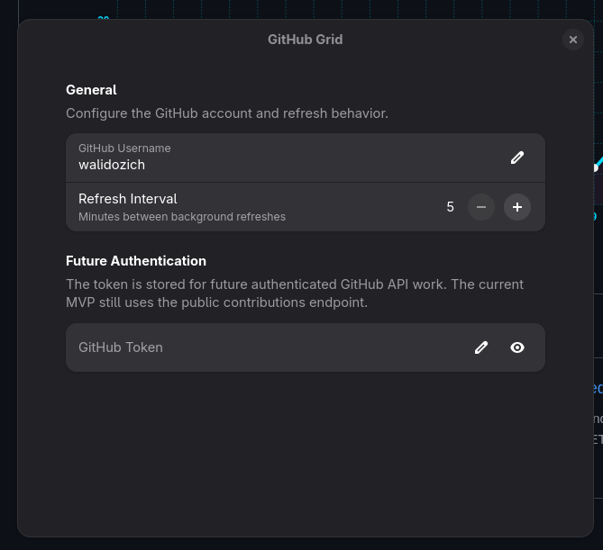
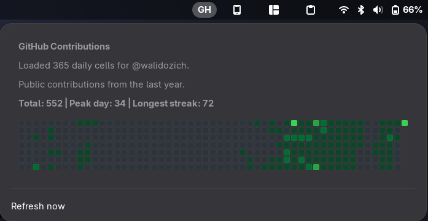

# GNOME GitHub Grid Extension

GNOME Shell extension that shows a GitHub-style contribution grid for a selected account in a top bar popup.

## Features

- Shows the last 365 days of GitHub contribution activity
- Renders a GitHub-style grid directly in the GNOME top bar popup
- Uses a configurable GitHub username
- Supports manual refresh and timed background refresh
- Displays summary data including total contributions, peak day, and longest streak
- Includes a preferences window for username and refresh interval

## Requirements

- GNOME Shell `46` or `49`
- `glib-compile-schemas`
- `gnome-extensions`
- `gjs`

## Install From Source

1. Copy the extension directory into the local GNOME extensions directory:

   ```bash
   mkdir -p ~/.local/share/gnome-shell/extensions/github-grid@walidozich
   cp -r github-grid@walidozich/. ~/.local/share/gnome-shell/extensions/github-grid@walidozich/
   ```

2. Compile the schema:

   ```bash
   glib-compile-schemas ~/.local/share/gnome-shell/extensions/github-grid@walidozich/schemas
   ```

3. On Wayland, log out and log back in if GNOME does not immediately discover the extension.

4. Check that GNOME sees the extension:

   ```bash
   gnome-extensions info github-grid@walidozich
   ```

5. Open preferences and set the GitHub username:

   ```bash
   gnome-extensions prefs github-grid@walidozich
   ```

6. Enable the extension:

   ```bash
   gnome-extensions enable github-grid@walidozich
   ```

## Build A Bundle

Build a distributable extension bundle with:

```bash
./scripts/package.sh
```

This writes:

```text
dist/github-grid@walidozich.shell-extension.zip
```

Install the built bundle with:

```bash
gnome-extensions install -f dist/github-grid@walidozich.shell-extension.zip
```

## Development Workflow

For local iteration without reinstalling the zip each time:

```bash
cp -r github-grid@walidozich/. ~/.local/share/gnome-shell/extensions/github-grid@walidozich/
glib-compile-schemas ~/.local/share/gnome-shell/extensions/github-grid@walidozich/schemas
gnome-extensions disable github-grid@walidozich || true
gnome-extensions enable github-grid@walidozich
```

If GNOME Shell appears to hold stale module state on Wayland after code changes, log out and log back in.

## Screenshots

### Preferences



### Popup



## How It Works

- The extension fetches public contribution data from GitHub's contributions endpoint
- It parses GitHub's current contribution markup and extracts real counts from the tooltip elements associated with each day cell
- It renders the data as week columns in a GNOME Shell popup
- It summarizes the visible range with total contributions, peak day, and longest streak

## Settings

The extension stores these settings:

- `username`
- `refresh-interval-minutes`
- `github-token`
- `cached-result`

Current behavior:

- `username` controls the GitHub account shown in the popup
- `refresh-interval-minutes` controls background refresh timing
- `github-token` is reserved for future authenticated API support
- `cached-result` stores the last successful payload for faster startup

## Testing

Run the local smoke tests with:

```bash
gjs -m tests/contributions-smoke.js
glib-compile-schemas github-grid@walidozich/schemas
```

What has been verified:

- shared parsing and summary logic through `gjs` smoke tests
- GNOME Shell extension discovery and activation
- valid username handling
- invalid username handling
- refresh path behavior
- rolling 365-day grid rendering
- chronological day ordering
- real count extraction from GitHub tooltip markup

Manual runtime checks are documented in:

```text
tests/manual-runtime-checklist.md
```

## Project Layout

```text
github-grid@walidozich/
├── contributions.js
├── extension.js
├── metadata.json
├── prefs.js
├── schemas/
│   └── org.gnome.shell.extensions.github-grid.gschema.xml
└── stylesheet.css
```

## Notes

- The popup is intentionally placed in the top bar instead of the notification list so it remains easy to reopen
- GitHub may change the structure of the contributions markup in the future; parsing logic may need updates if that happens
- A logout/login cycle can be necessary on Wayland when GNOME Shell caches imported extension modules
